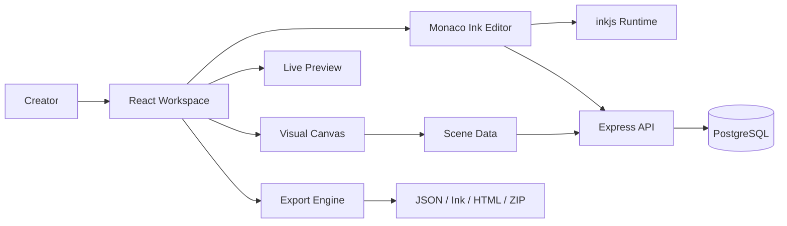

# CanvaCodeCraft

> **A Canva-style visual studio for building interactive fiction with Ink.**

CanvaCodeCraft combines a drag-and-drop game canvas with a real Ink script editor, live story preview, scene management, and portable exports. It is built for writers, indie developers, educators, and creators who want to make narrative games without beginning in an empty code window.

## ✨ What You Can Build

- Branching interactive stories
- Visual novels and dialogue-driven games
- Educational scenarios and simulations
- Choice-based prototypes
- Embeddable web story experiences

## 🧰 Core Features

- **Visual canvas** for placing text, buttons, and images
- **Ink editor** powered by Monaco with custom language support
- **Scene management** for organizing narrative screens
- **Live preview** using `inkjs`
- **Ink bindings** for dynamic text and interactive controls
- **Persistent storage** through PostgreSQL
- **Portable exports** to JSON, Ink, HTML, and ZIP

## 🖼️ Product Preview

Screenshots and a short demo GIF are the next product milestone. See issue #20 for the capture checklist.

Suggested showcase:

1. Full workspace
2. Drag-and-drop canvas editing
3. Ink script editor
4. Live game preview
5. Export dialog

## 🚀 Quick Start

### Prerequisites

- Node.js 20+
- npm
- A PostgreSQL database, such as Neon

### Install

```bash
git clone https://github.com/Cybersoulja/CanvaCodeCraft.git
cd CanvaCodeCraft
npm install
```

Create a `.env` file:

```env
DATABASE_URL=your_postgresql_connection_string
```

Start the development server:

```bash
npm run dev
```

Open the local URL shown in your terminal. The application runs the React frontend and Express backend together.

## 📜 Available Commands

```bash
npm run dev       # Start the development environment
npm run check     # Run TypeScript checks
npm run build     # Build the frontend and backend
npm start         # Run the production build
npm run db:push   # Push the Drizzle schema to PostgreSQL
```

## 🏗️ Architecture



## 🗂️ Project Structure

```text
CanvaCodeCraft/
├── client/                 # React frontend
│   └── src/
│       ├── components/     # Canvas, editor, preview, export, UI
│       ├── hooks/          # Custom React hooks
│       ├── lib/            # Ink and shared frontend utilities
│       └── pages/          # Application pages
├── server/                 # Express backend and API routes
├── shared/                 # Shared schemas and TypeScript types
├── CLAUDE.md               # AI assistant development guide
└── package.json
```

## 🧭 Product Direction

CanvaCodeCraft is growing toward a complete creator platform for interactive narratives:

- Easier visual story construction
- Reusable game-element templates
- Stronger Ink validation and debugging
- One-click playable web publishing
- AI-assisted story and scene creation
- Community templates and remixable projects
- Creator-friendly distribution and monetization

See [ROADMAP.md](ROADMAP.md) for the phased development path.

## 🗒️ Build in Public

GitHub is the product headquarters and source of truth for CanvaCodeCraft. Progress should be recorded through issues, pull requests, screenshots, roadmap updates, and short weekly build reports.

The public repository should remain useful and content-rich without exposing credentials, private infrastructure, customer data, or proprietary business operations.

## 🤝 Contributing

Contributions, experiments, bug reports, and developer diary entries are welcome. Read [CONTRIBUTING.md](CONTRIBUTING.md) before opening a pull request.

Before submitting code changes, run:

```bash
npm run check
npm run build
```

## 🧪 Project Status

CanvaCodeCraft is an active early-stage project. Core editing, preview, persistence, and export systems exist, while automated testing, onboarding, publishing, and creator workflows are still being expanded.

## 📄 License

MIT

---

Built by [Cybersoulja](https://github.com/Cybersoulja) as part of the **#DPSC learning-in-public journey**.
